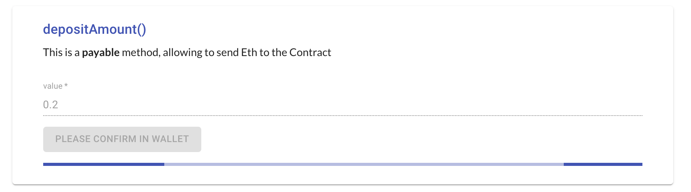
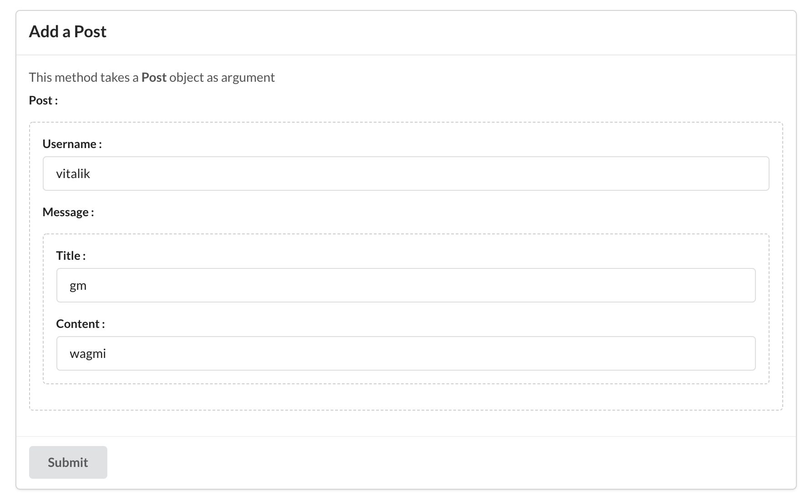
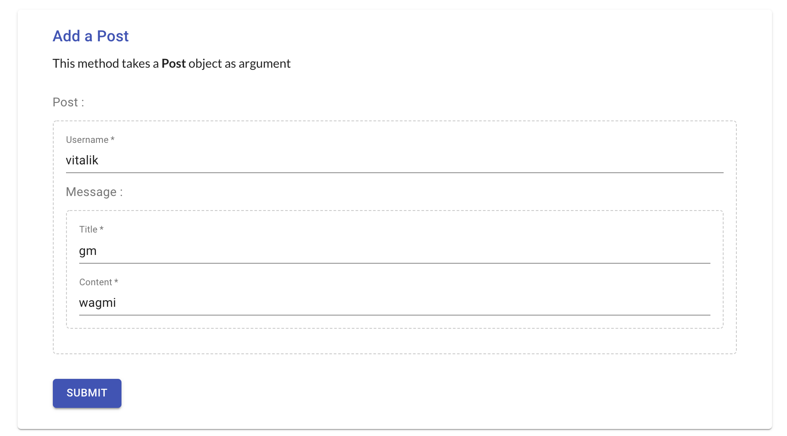
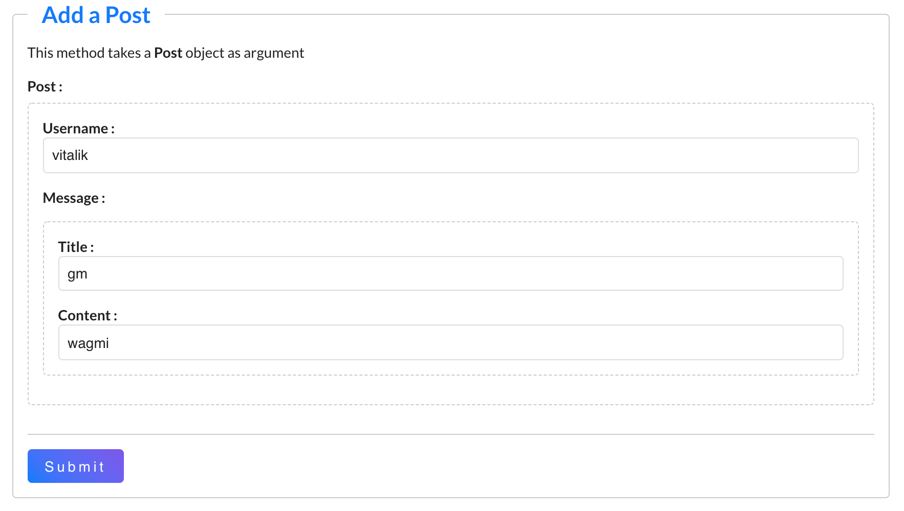

# ether-gui

React UI generator and web3 interactions for EVM compatible smart contracts.

Please note that this library is still in an early stage.

[See Demo](https://kind-bohr-8eaab4.netlify.app/) 

[Github](https://github.com/webmass/ether-gui) 


> Example of a Material UI styled "depositAmount()"
## Installation
```
yarn add ether-gui
```
or 
```
npm i ether-gui
```
## Requirements
react v17+, etherjs v5+
## Features
Generate full UI for contracts / contract methods, easily customizable to be user-friendly.

- Read
- Write
- "Scan Links" for Addresses and Transactions
- Transaction Status
- Most method types and parameters types are supported (struct included)
- Payable methods, Send Eth
- Easy bignumber formatting by the possibility to map fields to token addresses
- Inject custom components

## Examples

Please check the `examples` folder to see usage and customization options.
There you will find `chakra ui`, `material ui`, `semantic ui`, `custom` and `default` "themes".

## Usage
Basically, an `etherjs` `contract` is passed to `ContractInteractor` or `ContractMethod`, and the UI is automatically generated.

Many options are available to customize appearance, please check `examples/components/ExampleContractUI.jsx`

### Full Contract - simplest case
```JSX
import { ContractInteractor } from 'ether-gui';
import { Contract } from 'ethers';

// ...
// inside your component
const contract = new Contract(contractAddress, contractAbi, signerOrProvider);

return (
    <ContractInteractor contract={contract} />
)

```

### Single Method from Contract - simplest case
```JSX
import { ContractMethod } from 'ether-gui';
import { Contract } from 'ethers';

// ...
// inside your component
const contract = new Contract(contractAddress, contractAbi, signerOrProvider);

return (
    <ContractMethod contract={contract} methodSignature={'setStringExample(string)'} />
)

```
### ContractInteractor example with options

```JSX
<ContractInteractor
    // ContractInteractor will display all contract's methods by default
    contract={contract}

    // -- Customized Component to use for contract methods
    //ContractMethodComponent={StyledContractMethod}

    // -- specify a list of methods to show, order matters (by defaults all are shown)
    // methods={['balances(address)']}

    // -- exclude some methods
    excludeMethods={[
        'title()',
        'getNumberList()',
        'getDuo()',
        'setDuo(string,string)',
        'setDuoViaArray(string[2])',
    ]}

    // -- places readOnly methods first (true by default), otherwise alphabetical order only
    // readOnlyFirst={true}

    // -- specific options for specific methods
    methodsOptions={{
        // exact method signature
        'addPost((string,(string,string)))': {
            // options for that method signature
            title: 'Add a Post',
            beforeFields: <p>This method takes a <b>Post</b> object as argument</p>,
            fieldsOptions: {
                'post': { label: 'Post' },
                // object sub-fields options are with the "dot" notation
                'post.username': {
                    required: true,
                    placeholder: 'Vitalik',
                    label: 'Username',
                },
                'post.message': {
                    label: 'Message',
                },
                'post.message.title': {
                    required: true,
                    label: 'Title',
                },
                'post.message.content': {
                    required: true,
                    label: 'Content',
                }
            }
        },
        'posts(uint256)': {
            beforeFields: <p>This is a public variable of type Post[]</p>,
            afterFields: <p>"input_0" is the name automatically generated for the "index" parameter</p>,
            fieldsOptions: { input_0: { placeholder: 'Index of Existing Post, example : 0' } }
        },
        'depositAmount()': {
            beforeFields: <p>This is a <b>payable</b> method, allowing to send Eth to the Contract</p>
        },
        'setDuoViaArray(string[2])': {
            beforeFields: <p>This method takes an array of 2 string as argument</p>
        },
        'setNumberList(uint256[])': {
            beforeFields: <p>This method takes a list of numbers (seperated by commas) as argument</p>,
            // options for the fields/inputs
            fieldsOptions: {
                // options for the "_numberList" field/input
                _numberList: { placeholder: '1,2,3' }
            }
        },
        'setTitle(string)': {
            // Will prefill field/inputs by calling a read method from the contract
            initialStateGetters: {
                // => by default "setTitle(string)" will get the current title() value to prefill the "title" argument
                _title: 'title()',
            }
        },
        'balances(address)': {
            title: 'Custom title for "balances(address)" method',
            // ethFields is to indicate input/output fields that needs to be formatted as Eth (BigNumber with 18 decimals)
            ethFields: ['output_0'],
            btnLabel: 'Check balance in this contract',
            fieldsOptions: {
                input_0: {
                    label: 'Custom label for input_0',
                    required: true,
                },
                // options for the output, works the same as field/input options
                output_0: {
                    label: "User's balance in contract",
                }
            },
            // Prefill fields/inputs with some values
            // initialState: {
            //   input_0: 'some_address_to_use_as_default'
            // },
        }
    }}

    // -- default methodsOptions={}
    // defaultMethodOptions={{
    //   useSignerAddressAsDefault: true,
    // }}
/>
```

## Illustrations

Pictures of different styles for an `addPost` method that takes a `Post` as argument (corresponding to a `struct` in the Solidity contract and a JS object in the frontend)

#### Semantic UI style


#### Material UI style

#### Default style


### Tips welcome

If you like the project and wish to see it grow, please consider sending a [tip](https://bit.ly/3kN2rGM) ❤️
